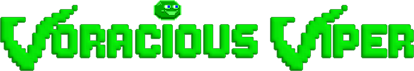

#  

*This Android game is inspired by Vicious Viper which was a game made by F. Kahlig from Spare Time Software in 1990.*

 

Beer, Wine, Coke, Steaks and Cake – This Viper is Voracious!

Simple to learn, hard to master, Voracious Viper is the newest creation of The Refactory.

You can follow me on my <a href="https://goo.gl/U0x1Fy">development blog</a> for the latest news on this and other projects of mine.

## Download
 
App now available on Google Play Store.

## Promotion Video

Watch the promotion video showing in-game footage.

## Screenshots

## Gameplay

Collect all eatable items within a minimum amount of steps. You get one extra life when completing a level.

## Bugs, Problems, Feedback?

The more you tell me, the better my apps get. Please use the comments on <a href="https://goo.gl/g0przi">Google Play Store</a> or visit <a href="http://goo.gl/KvKHze">my website</a> to post feedback. 

## Permissions

Your privacy is really important to me. The only permission that this app requires is internet access (android.permission.INTERNET). This is needed for the highscore list to function.

***

**LICENSE**

Copyright &copy; 2016 Christian DeTamble

Licensed under the GNU General Public License, Version 3.0. See [LICENSE](LICENSE) for details.

    https://www.gnu.org/licenses/gpl-3.0.txt

This game is inspired by 'Vicious Viper' which was a game made by F. Kahlig from Spare Time Software in 1990.

* Game Idea by F. Kahlig and Spare Time Software
* Sprites made by The Refactory
* Viper Sounds made with Bfxr 1.4.1, www.bfxr.net
* Applause Sound by Yannick Lemieux, CC Attribution 3.0
* Party Whistle Sound by www.freesfx.co.uk
* Music by Kevin MacLeod, including the following songs: Bit Quest, Nowhere Land, Pixelland, Ouroboros, Salty Ditty, Theme for Harold (var. 2), www.incompetech.com, CC Attribution 3.0
* libGDX game development framework, Apache-2.0

***

Crafted with &hearts; in <a href="http://goo.gl/KvKHze">The Refactory</a> in Ebensee 2016.

(My software is and stays open source, free of charge and ad-free)
